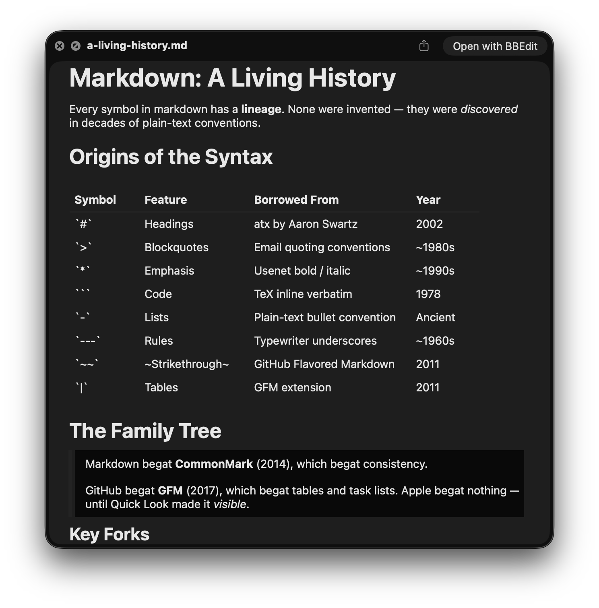
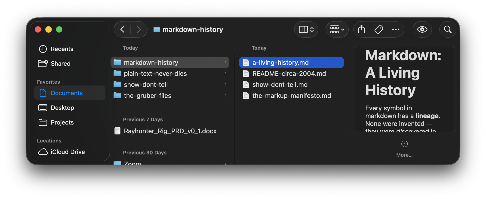
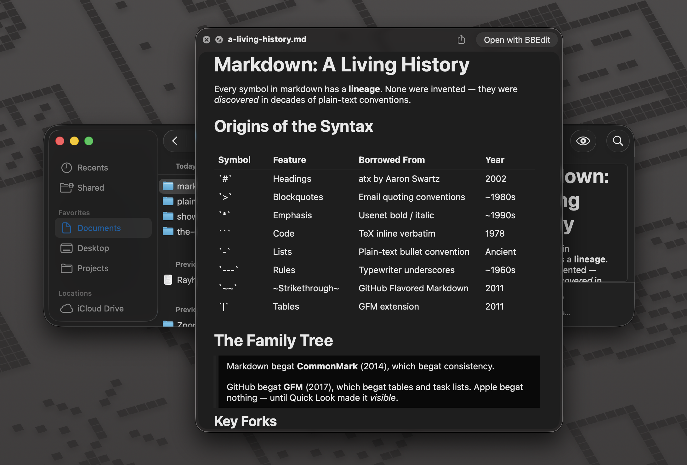
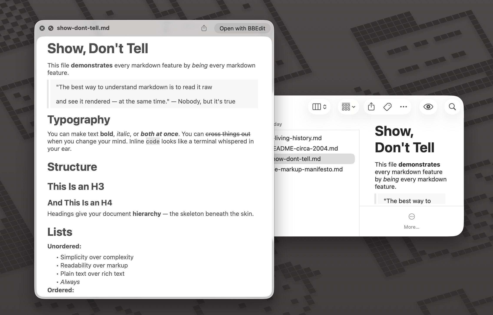
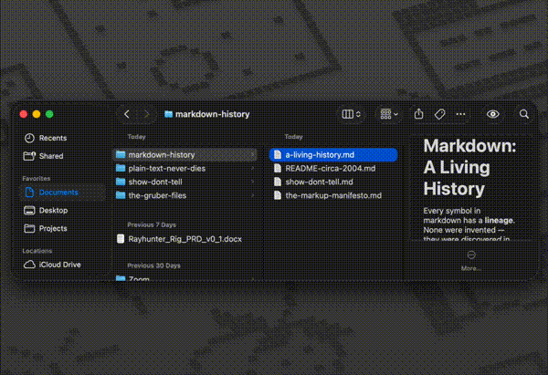

# MD Quick Look

> Finder is for browsing, not editing. See your markdown rendered — just press spacebar.

<p align="center">
  
</p>

[](LICENSE)
[](https://www.apple.com/macos/)
[](https://github.com/razielpanic/md-quick-look/releases)

Markdown strains human readability — deep heading hierarchies, tables, horizontal rules. MD Quick Look renders it all so you can actually read it.

## Features

- Headings, bold, italic, strikethrough, lists, blockquotes
- Code blocks with monospaced font
- GitHub-flavored tables with borders
- Automatic dark mode support
- Instant rendering — under 1 second

<p align="center">
  
</p>

<p align="center">
  
</p>

<p align="center">
  
</p>

## See It in Action

<p align="center">
  
</p>

Select any `.md` file in Finder and press spacebar. That's it.

## Installation

### Manual Installation

1. Download the latest **MD-Quick-Look.dmg** from [Releases](https://github.com/razielpanic/md-quick-look/releases)
2. Open the DMG file
3. Drag **MD Quick Look.app** to **/Applications**
4. **Launch the app once** (required to register the Quick Look extension)

## Troubleshooting

### First Launch Security Warning

macOS Gatekeeper may show: _"MD Quick Look.app cannot be opened because the developer cannot be verified"_

**Solution 1 (recommended):**
- Right-click on **MD Quick Look.app** in Applications
- Select **Open**
- Click **Open** again in the confirmation dialog

**Solution 2 (command line):**
```bash
xattr -dr com.apple.quarantine /Applications/MD\ Quick\ Look.app
```

### Extension Not Appearing?

**Verify installation:**
- App must be in **/Applications** (not ~/Applications or ~/Downloads)
- Launch the app at least once to register the extension
- Open **System Settings > Extensions > Quick Look**
- Enable **MD Quick Look** if unchecked

**Reload Quick Look:**
```bash
qlmanage -r
```

### Still Not Working?

**Restart Finder:**
- Press **Cmd + Option + Esc**
- Select **Finder**
- Click **Relaunch**

Or use terminal:
```bash
killall Finder
```

## Requirements

- **macOS 26 (Tahoe) or later**

## License

This project is licensed under the MIT License - see the [LICENSE](LICENSE) file for details.
